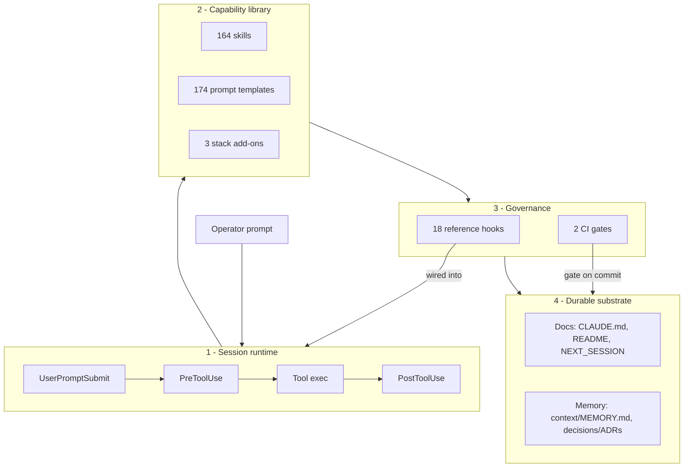

# Architecture

A bird's-eye view of what this repo *is* and how its parts fit together.

This is not a running application. The deliverable is a **Claude Code harness** — a library of advisory / design skills for the AI/ML lifecycle, plus the hooks, CI gates, and durable docs that govern how a session uses them. The "architecture" is therefore four layers: the **session runtime** a prompt flows through, the **capability library** it draws on, the **governance** that constrains it, and the **durable substrate** that survives across sessions.

Scale: **164 skills · 174 prompt templates · 18 reference hooks · 2 CI gates · 3 stack add-ons**.

---

## The four layers



The diagram carries the shape; the sections below carry the detail.

---

## How a request flows

1. **Prompt arrives.** Any `UserPromptSubmit` hooks run first — e.g. `scan_prompt_dlp.py` blocks a prompt carrying a secret / SSN / card *before* it enters model context and the transcript.
2. **Claude orients.** `CLAUDE.md` is auto-loaded; `NEXT_SESSION.md` and `context/MEMORY.md` restore prior state so the session resumes instead of re-deriving.
3. **A skill is invoked.** A slash command (`/rag-design`, `/security-audit`, …) loads that skill's `SKILL.md`. Parameterizable skills have a 1:1 template in `prompts/` that fills an LLM system prompt; facilitator / operator skills *are* the procedure.
4. **Tools execute under guardrails.** `PreToolUse` hooks gate the mutating tools — `scan_secrets.py` on writes, `block_dangerous_git.py` and `check_egress_allowlist.py` on Bash. `PostToolUse` hooks act on results — `redact_tool_output.py` masks secrets/PII in output, `audit_log.py` records the call.
5. **Work is committed.** CI gates run on the diff: `doc-ci.yml` enforces doc parity + links + counts, `dlp-scan.yml` runs a pattern + fingerprint scan.
6. **Durable state is refreshed.** The bookmark, memory index, and lesson log are updated so the next session starts warm.

Layers 1 and 3 are the same machinery viewed two ways: the hooks *are* the governance, attached at runtime events.

---

## Layer 1 — Session runtime

The Claude Code lifecycle. The template treats these events as attach points rather than owning the runtime. Events in play today: `SessionStart`, `UserPromptSubmit`, `PreToolUse`, `PostToolUse`, `Stop` / `SubagentStop`, `SessionEnd` / `PreCompact`. See [`.claude/hooks/README.md`](.claude/hooks/README.md) for the full 2026 event catalog.

## Layer 2 — Capability library (the product)

- **`.claude/skills/`** — 164 skills, each a directory with a `SKILL.md`. They span the lifecycle: discovery & framing, EDA & statistics, data engineering & quality, modeling & algorithms, domain ML (NLP / CV / audio / time-series / graph / geospatial), validation & responsible AI, MLOps & deployment, LLM · agents · guardrails, and cloud / Databricks / auth-security. The full indexed list lives in [`CLAUDE.md`](CLAUDE.md) § Automation.
- **`prompts/`** — 174 system-prompt templates, a 1:1 parametric mirror of the parameterizable skills, each with placeholders, usage notes, and a health score. Index: [`prompts/README.md`](prompts/README.md).
- **`stacks/`** — 3 language add-ons (`python`, `typescript`, `go`), each shipping `/test-gen`, `/type-fix`, `/deps-audit`. Copy into `.claude/skills/` to adopt.

**Skill-authoring contract (load-bearing):** a skill is not "done" until 5 artifacts exist — `SKILL.md` + `prompts/<name>.md` + a row in [`CLAUDE.md`](CLAUDE.md) + a row in [`README.md`](README.md) + a row in [`prompts/README.md`](prompts/README.md). Facilitator / operator skills are exempt from the prompt-template requirement. `/doc-ci-check` and `doc-ci.yml` enforce this parity.

## Layer 3 — Governance (fail-safe guardrails)

- **18 reference hooks** in `.claude/hooks/`, **none wired by default** — 3 generic + 10 domain guardrails + 3 DLP + 2 optional add-ons. They *detect presence, not absence* and carry documented escape hatches, so a newly wired control never silently breaks a workflow. Wiring snippets and smoke tests in [`.claude/hooks/README.md`](.claude/hooks/README.md).
- **2 CI gates** in `.github/workflows/`: `doc-ci.yml` (5-artifact parity · broken relative links · count drift) and `dlp-scan.yml` (regex + SHA-256 fingerprint scan on every diff).
- **Permission posture:** [`.claude/settings.json`](.claude/settings.json) pre-allows only safe read-only ops; mutating tools and machine-local hook wiring go in the gitignored `settings.local.json`. The template ships unwired so downstream adopters opt in deliberately.

## Layer 4 — Durable substrate (survives compaction)

The files that persist context across `/clear`, `/compact`, and new sessions:

| File | Role |
|---|---|
| [`CLAUDE.md`](CLAUDE.md) | Auto-loaded posture + the skill/automation index |
| [`README.md`](README.md) | Human-facing index and setup guide |
| [`NEXT_SESSION.md`](NEXT_SESSION.md) | Resume bookmark — HEAD, what landed, what's held, what not to do |
| [`LESSONS_LEARNED.md`](LESSONS_LEARNED.md) | Process lessons that accumulate across sessions |
| [`operating-philosophy.md`](operating-philosophy.md) | Portable working philosophy, copy into any project |
| [`analysis-methodology.md`](analysis-methodology.md) | Reusable research / audit methodology |
| [`context/MEMORY.md`](context/MEMORY.md) | Index for persistent project memory |
| [`decisions/`](decisions/) | Architecture Decision Records |
| [`templates/skill/SKILL-TEMPLATE.md`](templates/skill/SKILL-TEMPLATE.md) | Authoring template for new skills |

---

## Repo map

```
claude-code-template/
├── CLAUDE.md                  # auto-loaded posture + skill index
├── README.md                  # human index + setup
├── ARCHITECTURE.md            # this file
├── NEXT_SESSION.md            # resume bookmark
├── LESSONS_LEARNED.md         # accumulated process lessons
├── operating-philosophy.md    # portable working philosophy
├── analysis-methodology.md    # reusable audit methodology
├── .claude/
│   ├── skills/                # 164 skills (dir per skill, SKILL.md)
│   ├── hooks/                 # 18 reference guardrail hooks + README
│   └── settings.json          # read-only permission allowlist
├── prompts/                   # 174 system-prompt templates + README
├── stacks/                    # python · typescript · go add-ons
├── scripts/                   # dlp_fingerprint_scan.py + helpers
├── templates/                 # adr + skill authoring templates
├── decisions/                 # ADRs
├── context/                   # MEMORY.md — persistent memory index
├── docs/                      # reference docs
└── .github/workflows/         # doc-ci.yml · dlp-scan.yml
```

---

## Design invariants

- **Unwired by default.** Hooks and DLP ship inert; adopters opt in per-machine via `settings.local.json`. The template never imposes enforcement it can't see the adopter's context for.
- **Fail-safe guardrails.** Detection hooks default to allowing on ambiguity except where the security cost inverts that (egress with an unconfirmable destination fails *closed*). Escape hatches (`# dlp-ok`, `ALLOW_EGRESS=<host>`) keep correct work unblocked.
- **Parity is mechanical, not remembered.** The 5-artifact contract is enforced by CI, not discipline.
- **Docs are the source of truth, not PR descriptions.** Anything an operator must know to run the template safely lives in a repo file.
